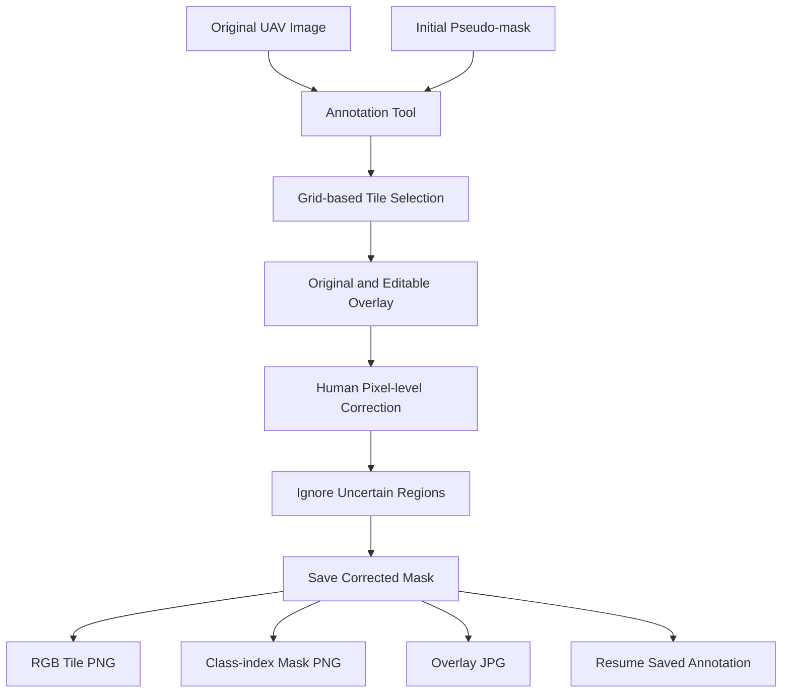

# 04 annotation workflow

```mermaid
flowchart TD
    A[Original UAV Image] --> C[Annotation Tool]
    B[Initial Pseudo-mask] --> C
    C --> D[Grid-based Tile Selection]
    D --> E[Original and Editable Overlay]
    E --> F[Human Pixel-level Correction]
    F --> G[Ignore Uncertain Regions]
    G --> H[Save Corrected Mask]
    H --> I[RGB Tile PNG]
    H --> J[Class-index Mask PNG]
    H --> K[Overlay JPG]
    H --> L[Resume Saved Annotation]
```
