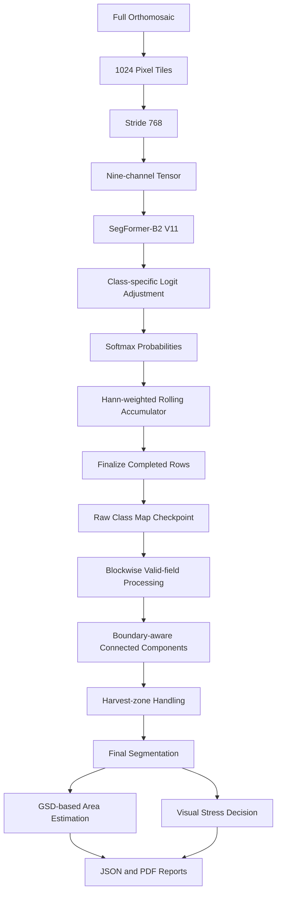

# 05 optimized inference

```mermaid
flowchart TD
    A[Full Orthomosaic] --> B[1024 Pixel Tiles]
    B --> C[Stride 768]
    C --> D[Nine-channel Tensor]
    D --> E[SegFormer-B2 V11]
    E --> F[Class-specific Logit Adjustment]
    F --> G[Softmax Probabilities]
    G --> H[Hann-weighted Rolling Accumulator]
    H --> I[Finalize Completed Rows]
    I --> J[Raw Class Map Checkpoint]
    J --> K[Blockwise Valid-field Processing]
    K --> L[Boundary-aware Connected Components]
    L --> M[Harvest-zone Handling]
    M --> N[Final Segmentation]
    N --> O[GSD-based Area Estimation]
    N --> P[Visual Stress Decision]
    O --> Q[JSON and PDF Reports]
    P --> Q
```
